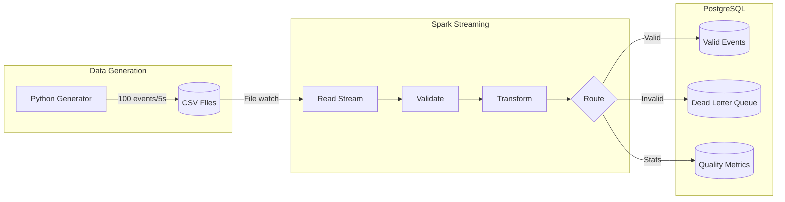
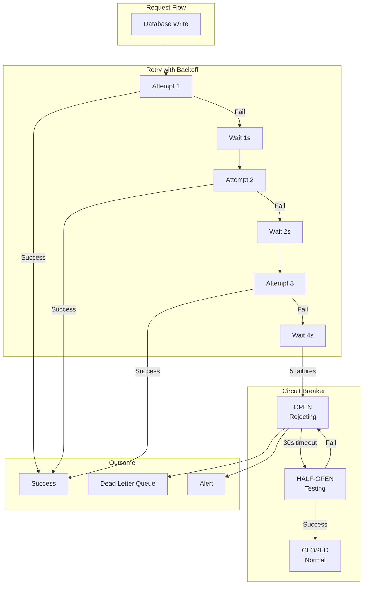
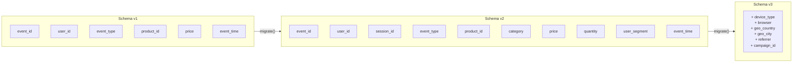
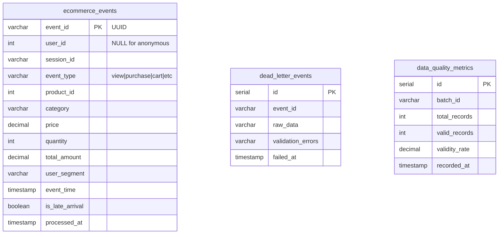

#  E-Commerce Real-Time Streaming Pipeline

[](https://www.python.org/)
[](https://spark.apache.org/)
[](https://www.postgresql.org/)
[](https://www.docker.com/)
[](#testing)

A **production-ready** real-time data pipeline for processing e-commerce events using Apache Spark Structured Streaming and PostgreSQL. Features include schema versioning, fault tolerance with retry logic and circuit breakers, comprehensive monitoring and alerting, and 124+ unit tests.

---

##  Table of Contents

- [Overview](#-overview)
- [Architecture](#-architecture)
- [Features](#-features)
- [Quick Start](#-quick-start)
- [Detailed Setup Guide](#-detailed-setup-guide)
- [Project Structure](#-project-structure)
- [Configuration](#-configuration)
- [Monitoring & Alerting](#-monitoring--alerting)
- [Testing](#-testing)
- [API Reference](#-api-reference)
- [Troubleshooting](#-troubleshooting)
- [Contributing](#-contributing)

---

##  Overview

This project simulates a **production-grade real-time data pipeline** for an e-commerce platform. It captures user actions (views, purchases, cart operations), processes them in real-time, validates data quality, and stores them for analytics.

### What It Does

```
┌─────────────────────────────────────────────────────────────────────────────┐
│                         E-COMMERCE STREAMING PIPELINE                        │
│                                                                             │
│   User Actions    →     CSV Files    →     Spark    →     PostgreSQL │
│  (simulated)             (staging)           (process)         (analytics)  │
│                                                                             │
│  • View product          • Batch files       • Validate        • Query data │
│  • Add to cart           • Every 5 sec       • Transform       • Analytics  │
│  • Purchase              • 100 events        • Enrich          • Reports    │
│  • Search                                    • Route           • Dashboards │
└─────────────────────────────────────────────────────────────────────────────┘
```

---

##  Architecture

### High-Level Data Flow




### Fault Tolerance Architecture



### Schema Evolution



### Database Entity Relationship



---

##  Features

### Core Features

| Feature | Description |
|---------|-------------|
| **Real-time Streaming** | Process events within seconds of generation |
| **Data Validation** | 10+ validation rules with detailed error tracking |
| **Dead Letter Queue** | Invalid records preserved for analysis |
| **Deduplication** | Prevent duplicate event processing |
| **Business Logic** | Enforce rules (purchase requires login) |

### Production Features

| Feature | Description |
|---------|-------------|
| **Schema Registry** | Version control for data schemas with migrations |
| **Retry Logic** | Exponential backoff with configurable policies |
| **Circuit Breaker** | Prevent cascade failures |
| **Monitoring** | Real-time metrics and health tracking |
| **Alerting** | Multi-channel alerts (Console, File, Slack) |
| **Configuration** | Centralized, environment-based config |

### Event Types

| Event | Description | Requires Login |
|-------|-------------|----------------|
| `view` | User views product page |  No |
| `search` | User searches for products |  No |
| `add_to_cart` | User adds item to cart |  Yes |
| `remove_from_cart` | User removes item from cart |  Yes |
| `wishlist` | User saves item for later |  Yes |
| `purchase` | User completes purchase |  Yes |

---

##  Quick Start

### Prerequisites

- **Docker Desktop** (4GB+ RAM allocated)
- **Python 3.10+**
- **Git**

### One-Minute Setup

```powershell
# 1. Clone the repository
git clone https://github.com/Zaina-M/ecommerce-streaming-pipeline.git
cd ecommerce-streaming-pipeline

# 2. Start PostgreSQL
cd docker
docker compose up -d postgres

# 3. Wait for database to be ready (10 seconds)
Start-Sleep -Seconds 10

# 4. Start Spark streaming
docker compose up -d spark

# 5. Run data generator (in new terminal)
cd ../data_generator
pip install -r requirements.txt
python data_generator.py

# 6. Check results (after 30 seconds)
cd ../docker
docker exec ecommerce_postgres psql -U spark -d ecommerce -c "SELECT event_type, COUNT(*) FROM ecommerce_events GROUP BY event_type;"
```

---

##  Detailed Setup Guide

### Step 1: Environment Setup

#### 1 Install Prerequisites

```powershell
# Verify Docker is running
docker --version
docker compose version

# Verify Python
python --version  # Should be 3.10+

# Install Python dependencies
cd data_generator
pip install -r requirements.txt
```

### Step 2: Start Infrastructure

#### 2.1 Start PostgreSQL

```powershell
cd docker
docker compose up -d postgres
```

#### 2.2 Verify Database is Ready

```powershell
# Check if container is running
docker compose ps

# Test database connection
docker exec ecommerce_postgres pg_isready -U spark

# View tables created
docker exec ecommerce_postgres psql -U spark -d ecommerce -c "\dt"
```

Expected tables:
- `ecommerce_events` - Valid events
- `dead_letter_events` - Invalid events
- `data_quality_metrics` - Quality stats

#### 2.3 Start Spark Streaming

```powershell
docker compose up -d spark

# View Spark logs
docker logs spark_master --tail 50

# Follow logs in real-time
docker logs -f spark_master
```

### Step 3: Generate Data

#### 3.1 Run Data Generator

Open a **new terminal**:

```powershell
cd data_generator
python data_generator.py
```

You'll see output like:
```
Starting E-Commerce Event Generator
Output directory: ../data/input
Batch size: 100 events
Interval: 5.0 seconds
Press Ctrl+C to stop

[2026-01-29 10:30:00] Generated batch 1: 100 events → events_20260129_103000_abc123.csv
[2026-01-29 10:30:05] Generated batch 2: 100 events → events_20260129_103005_def456.csv
```

#### 3.2 Monitor Data Flow

In another terminal, watch the pipeline:

```powershell
# Count events in database (run periodically)
docker exec ecommerce_postgres psql -U spark -d ecommerce -c "
    SELECT 
        'Valid Events' as table_name, COUNT(*) as count FROM ecommerce_events
    UNION ALL
    SELECT 
        'Invalid Events', COUNT(*) FROM dead_letter_events;
"

# View event distribution
docker exec ecommerce_postgres psql -U spark -d ecommerce -c "
    SELECT event_type, COUNT(*) as count, 
           ROUND(SUM(total_amount)::numeric, 2) as revenue
    FROM ecommerce_events 
    GROUP BY event_type 
    ORDER BY count DESC;
"
```

### Step 4: Query Analytics

```powershell
# Connect to PostgreSQL
docker exec -it ecommerce_postgres psql -U spark -d ecommerce
```

Then run SQL queries:

```sql
-- Hourly activity
SELECT * FROM v_hourly_event_summary ORDER BY hour DESC LIMIT 10;

-- Category performance
SELECT * FROM v_category_performance;

-- User segment analysis  
SELECT * FROM v_user_segment_analysis;

-- Data quality dashboard
SELECT * FROM v_data_quality_dashboard;

-- Exit
\q
```

### Step 5: Stop the Pipeline

```powershell
# Stop data generator: Press Ctrl+C in that terminal

# Stop all containers
cd docker
docker compose down

# Stop and remove all data (fresh start)
docker compose down -v
```

---

##  Project Structure

```
ecommerce-streaming-pipeline/
│
├──  config/                      #  Configuration Management
│   ├── __init__.py
│   └── settings.py                 # Centralized config with env var support
│
├──  data/                        #  Data Storage
│   ├── checkpoints/                # Spark checkpoints for fault tolerance
│   ├── input/                      # CSV files from data generator
│   └── logs/                       # Application logs
│
├──  data_generator/              #  Data Generation
│   ├── data_generator.py           # Event generator script
│   └── requirements.txt            # Python dependencies
│
├──  docker/                      #  Docker Configuration
│   ├── docker-compose.yml          # Service orchestration
│   ├── .env                        # Environment variables
│   ├── postgres/
│   │   └── postgres_setup.sql      # Database schema
│   └── spark/
│       └── Dockerfile              # Spark image config
│
├──  spark/                       #  Spark Application
│   ├── spark_streaming_to_postgres.py  # Main streaming job
│   ├──  schema/                  # Schema Registry
│   │   ├── __init__.py
│   │   └── registry.py             # Schema versioning & migration
│   ├──  utils/                   # Utilities
│   │   ├── __init__.py
│   │   └── retry.py                # Retry logic & circuit breaker
│   └──  monitoring/              # Monitoring & Alerting
│       ├── __init__.py
│       └── metrics.py              # Pipeline metrics & alerts
│
├──  tests/                       
│   ├── test_data_generator.py       
│   ├── test_transformations.py     
│   ├── test_config.py              
│   ├── test_retry.py              
│   ├── test_monitoring.py          
│   └── test_schema_registry.py     
│
├──  docs/                       
│   ├── project_overview.md
│   ├── user_guide.md
│   ├── test_cases.md
│   └── performance_metrics.md
│
├── README.md                      
├── pytest.ini                      
└── .env                           
```

---

##  Configuration

### Environment Variables

All configuration is managed through environment variables with sensible defaults:

#### Database Settings

| Variable | Default | Description |
|----------|---------|-------------|
| `POSTGRES_HOST` | `localhost` | Database host |
| `POSTGRES_PORT` | `5433` | Database port |
| `POSTGRES_DB` | `ecommerce` | Database name |
| `POSTGRES_USER` | `spark` | Database user |
| `POSTGRES_PASSWORD` | `spark123` | Database password |

#### Streaming Settings

| Variable | Default | Description |
|----------|---------|-------------|
| `TRIGGER_INTERVAL` | `10 seconds` | Spark trigger interval |
| `WATERMARK_DELAY` | `10 minutes` | Late data tolerance |
| `MAX_FILES_PER_TRIGGER` | `10` | Max files per batch |

#### Data Quality Settings

| Variable | Default | Description |
|----------|---------|-------------|
| `MIN_VALIDITY_RATE` | `95.0` | Alert threshold (%) |
| `MAX_PRICE` | `10000.0` | Maximum valid price |
| `LATE_ARRIVAL_MINUTES` | `5` | Late arrival threshold |

#### Retry Settings

| Variable | Default | Description |
|----------|---------|-------------|
| `MAX_RETRIES` | `3` | Maximum retry attempts |
| `INITIAL_RETRY_DELAY` | `1.0` | Initial delay (seconds) |
| `RETRY_BACKOFF_FACTOR` | `2.0` | Exponential backoff factor |
| `CIRCUIT_BREAKER_THRESHOLD` | `5` | Failures before circuit opens |

---

##  Monitoring & Alerting

### Pipeline Metrics

The monitoring system tracks:

| Metric | Description |
|--------|-------------|
| `records_read` | Total records ingested |
| `records_valid` | Records passing validation |
| `records_invalid` | Records failing validation |
| `validity_rate` | Percentage of valid records |
| `processing_time_ms` | Batch processing latency |
| `throughput` | Records per second |

### Alert Levels

| Level | Trigger | Action |
|-------|---------|--------|
| `INFO` | Normal operation | Log only |
| `WARNING` | Single threshold breach | Log + Optional notification |
| `ERROR` | Consecutive failures | Log + Alert |
| `CRITICAL` | System degradation | Log + Immediate alert |

### Viewing Logs

```powershell
# Spark logs
docker logs spark_master --tail 100

# Log file (if configured)
Get-Content data/logs/spark_streaming_*.log -Tail 50
```

---

##  Testing

### Run All Tests

```powershell
cd ecommerce-streaming-pipeline

# Run all unit tests (fast)
python -m pytest tests/ -v --ignore=tests/test_schema_registry.py

# Run with coverage
python -m pytest tests/ -v --cov=. --cov-report=html

# Run specific test file
python -m pytest tests/test_data_generator.py -v

# Run specific test class
python -m pytest tests/test_retry.py::TestCircuitBreaker -v
```

### Test Categories

| Test File | Tests | Description |
|-----------|-------|-------------|
| `test_data_generator.py` | 40 | Event generation, business logic |
| `test_transformations.py` | 25 | Validation, enrichment |
| `test_config.py` | 17 | Configuration management |
| `test_retry.py` | 22 | Retry logic, circuit breaker |
| `test_monitoring.py` | 20 | Metrics, alerting |

##  Troubleshooting

### Common Issues

#### 1. PostgreSQL Connection Failed

```powershell
# Check if container is running
docker compose ps

# Check PostgreSQL logs
docker logs ecommerce_postgres

# Verify port is not in use
netstat -an | findstr 5433

# Restart PostgreSQL
docker compose restart postgres
```

#### 2. Spark Not Processing Files

```powershell
# Check Spark logs
docker logs spark_master --tail 100

# Verify data files exist
dir data/input

# Check checkpoint directory
dir data/checkpoints

# Restart Spark
docker compose restart spark
```

#### 3. Data Generator Errors

```powershell
# Check Python version
python --version

# Install dependencies
pip install -r data_generator/requirements.txt

# Run with verbose output
python -c "from data_generator.data_generator import generate_event; print(generate_event())"
```

#### 4. Tests Failing

```powershell
# Run with verbose output
python -m pytest tests/test_data_generator.py -v --tb=long

# Check for import errors
python -c "from data_generator.data_generator import generate_event"

# Run single test
python -m pytest tests/test_data_generator.py::TestGenerateEvent::test_generate_event_returns_dict -v
```

### Logs and Debugging

```powershell
# All container logs
docker compose logs

# Follow Spark logs
docker compose logs -f spark

# PostgreSQL shell
docker exec -it ecommerce_postgres psql -U spark -d ecommerce

# Check running processes
docker compose top
```

---

##  Contributing

### Development Setup

```powershell
# Clone repository
git clone https://github.com/Zaina-M/ecommerce-streaming-pipeline.git
cd ecommerce-streaming-pipeline

# Create virtual environment
python -m venv venv
.\venv\Scripts\Activate

# Install dependencies
pip install -r data_generator/requirements.txt
pip install pytest pytest-cov

# Run tests
python -m pytest tests/ -v
```


##  Documentation

- [Project Overview](docs/project_overview.md) - Detailed component description
- [User Guide](docs/user_guide.md) - Step-by-step setup instructions
- [Test Cases](docs/test_cases.md) - Test documentation
- [Performance Metrics](docs/performance_metrics.md) - Benchmarks and SLAs

---


