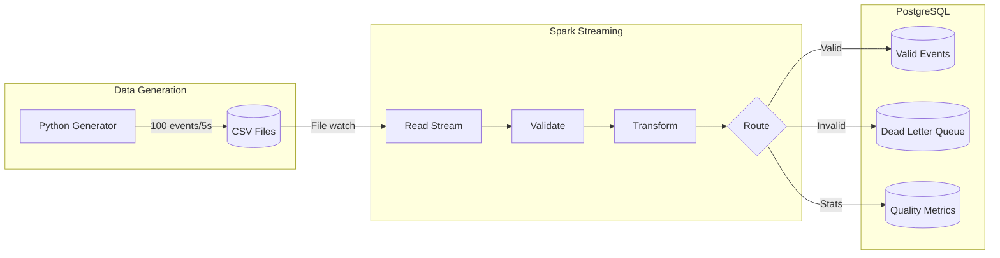
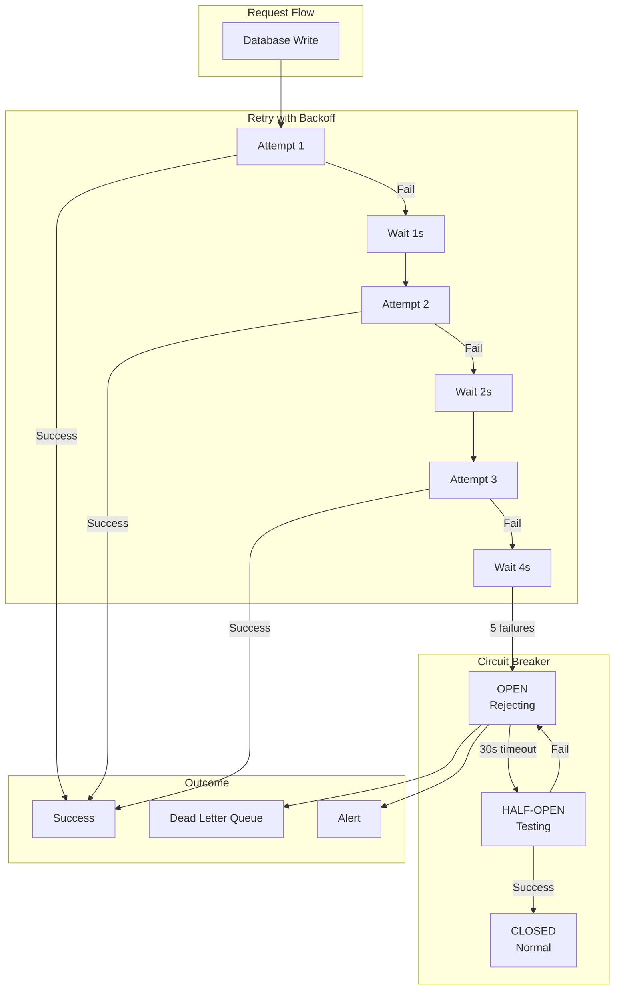
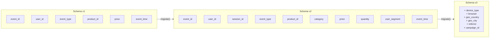
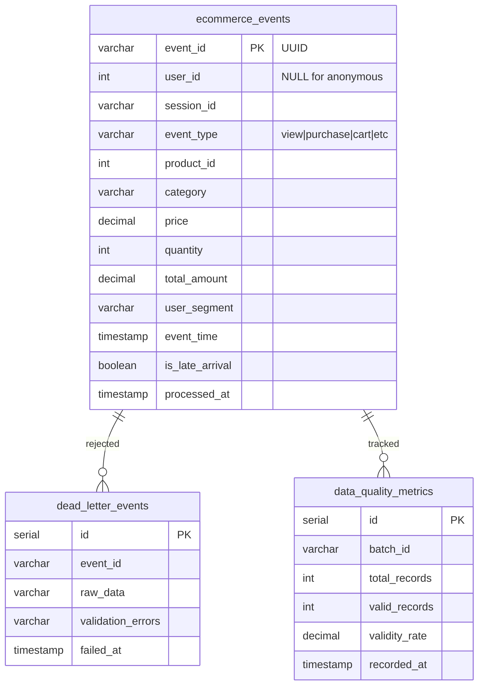
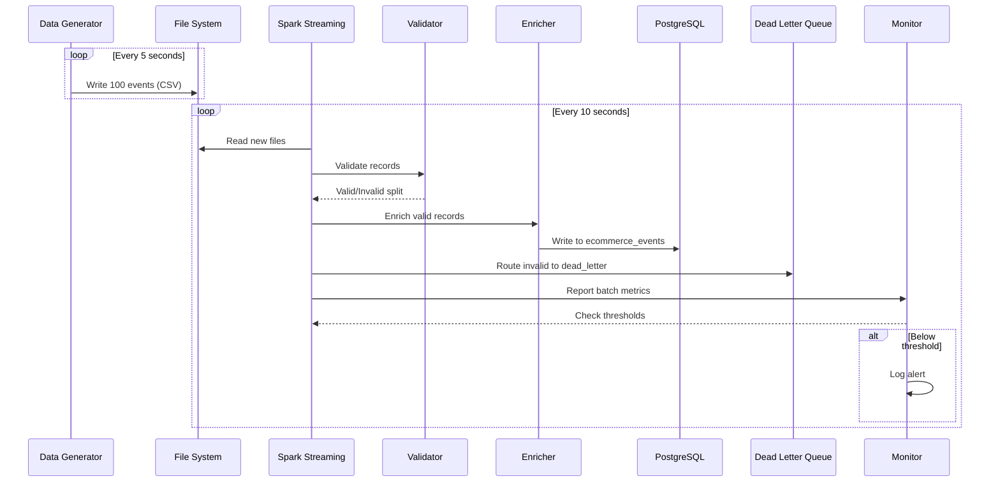
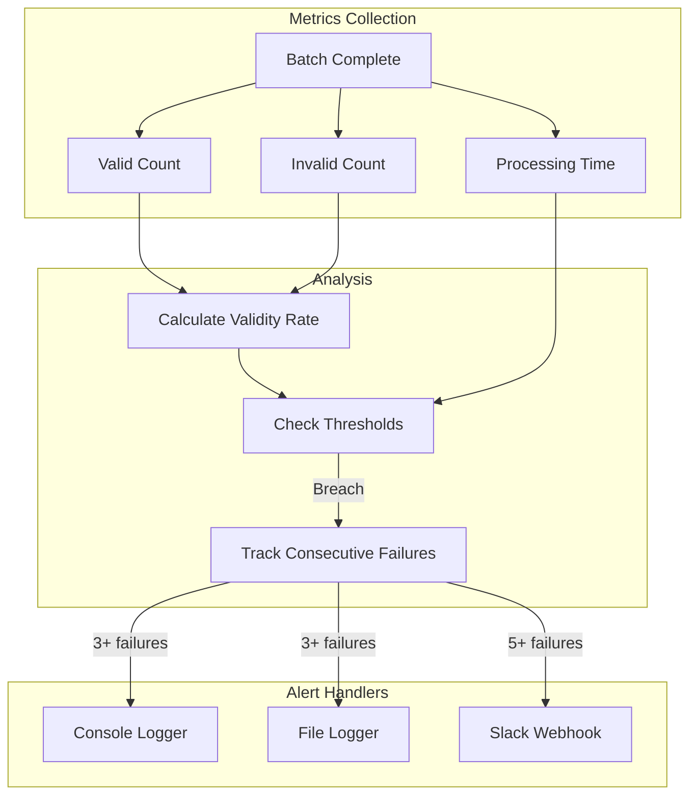

# E-Commerce Streaming Pipeline - Architecture Diagrams

## 1. High-Level Data Flow

---

## 2. Fault Tolerance Architecture

---

## 3. Schema Evolution

---

## 4. Database Entity Relationship

---

## 5. Event Processing Pipeline

---

## 6. Monitoring & Alerting Flow

---

## How to View These Diagrams
### VS Code
Install the "Markdown Preview Mermaid Support" extension.

